# CoffeePotDevice

This repository contains the source code for the "***Coffee Pot Quantum Entangled Device Twin***" used in the <a target="_blank" href="https://github.com/Mission-Mars-Fourth-Horizon-Org/Mission-Briefings/tree/master/IoTHubs">IoTHubs</a> Mission Mars mission.

The "***Coffee Pot Quantum Entangled Device Twin***" needs to be run by the PRESENTER (not the attendees) at a Mission Mars event.  

As a presenter, there are a few steps you'll have to do to prepare the CoffePotDevice.  Those steps are documented completely in this document. 

## Prerequisites

To configure the IoT Hub used by the CoffeePotDevice as well as to run the CoffeePotDevice app you will need the following

- Windows 10 - The CoffeePotDevice app is a UWP app.  At this time, no cross-platform version of the app exists
- PowerShell - The "PrepareMarsIoTHub.ps1" script helps you provision the Azure resources needed by the app.
- Azure-CLI 2.0 (<a target="_blank" href="https://docs.microsoft.com/en-us/cli/azure/install-azure-cli">Install Docs</a>) - This is used by the "PrepareMarsIoTHub.ps1" script to create the resources in Azure.
- Visual Studio 2015 Community Edition or Later - Used to load the CoffeePotDevice app source code and run it.
- Device Explorer (Optional) - Follow the instructions to install it on the <a target="_blank" href="https://github.com/Azure/azure-iot-sdk-csharp/tree/master/tools/DeviceExplorer">How to use Device Explorer for IoT Hub devices</a> page

## Tasks

1. [Prepare the Azure IoT Hub needed by the app](#prep)
1. [Make the coffeeclient Connection String available to attendees](#coffeeclient)
1. [Run and configure the CoffeePotDevice UWP App](#run)
1. [Testing the CoffeePotDevice app with Device Explorer](#testing)
1. [Prepare the Team Cards](#teamcards)
1. [Clean up after the event](#cleanup)

---

<a name="prep"></a>

## Prepare the Azure IoT Hub needed by the app

You need to configure an IoT Hub and device in Azure that the CoffeePotDevice app will connect to.  Once attendees have complete the tutorial walkthroughs, they will modify they code they have written to  point to the hub you create below rather then the one they created in the lab, via a Consumer Group that maps to their "teamxx" number and communicate with the "coffeepot" device simulated by the "CoffeePotDevice" app.

For this to all work you need to create the following items in ***your*** azure subscription:

- An Azure Resource Group
- An Azure IoT Hub
- A "coffeeclient" SAS Policy in the hub with "ServiceConnect" permissions that the attendees will use to connect to your hub.
- A "coffeepot" device identity that the CoffeePotDevice app will connect as
- A "teamxx" consumer group on the "events" endpoint for "team01"-"team20" that the attendess will use to listen for messages coming back from the CoffeePotDevice simulated app.

To help you in this effort, A PowerShell script that uses the "Azure CLI 2.0" cross platform cli has been created to provision all of the required resources. Use these steps to run the script:

1. Clone this repo down to your computer (wherever and however you choose)
1. Open a ***PowerShell*** prompt and change into the `/Scripts` directory in the repo.
1. Login to the azure cli and ensure that the desired subscription is current (Read <a target="_blank" href="https://docs.microsoft.com/en-us/cli/azure/authenticate-azure-cli">Log in with Azure CLI 2.0</a> for more details):

    ```bash
    az login
    ```

    Then use these commands to list, set and show your account info

    ```bash
    az account list
    az account set
    az account show
    ```

1. Decide on a name for the Resource Group and IoT Hub you will create an the Location where you want them. It's suggested that you use a name that includes "mars" to keep in theme with the event.  Perhaps appending your city name, airport code, etc. to help keep it unique. For example, if you were configuring the resources for an event in Seattle you might use  the `sea` airport code in your names:

    - Resource Group Name: **`marsgroupsea`**
    - IoT Hub Name: **`marsiotsea`**
    - Location: **`westus`** (Since Seattle is on the West Coast of the US)

1. Use the names and locations chosen above to run the `./Scripts/PepareMarsIoTHub.ps1` script.  The script will take a few minutes (5-ish) to complete. Creating the IoT Hub and Consumer Groups take up most of the time:

    > **Note**: When executing the `PrepareMarsIoTHub.ps1` script you must prefix it with the "**`./`**" current directory reference for PowerShell to properly locate it.

    ```bash
    ./PrepareMarsIoTHub.ps1 -g <resourece-group-name> -n <iot-hub-name> -l <location>
    ```

    For example using the names we chose above:

    ```bash
    ./PrepareMarsIoTHub.ps1 -g marsgroupsea -n marsiotsea -l westus
    ```

1. When the script is done executing, the details of the resources created are shown at end (there are a lot of them so you will need to scroll).  Keep these resources up on the screen so you can use them in the next step:

    ```bash
    ================================================================================
    Showing Details
    ================================================================================


    ================================================================================
    marsiotsea IoT Hub Details
    --------------------------------------------------------------------------------
    Location    Name        ResourceGroup    Resourcegroup    Subscriptionid
    ----------  ----------  ---------------  ---------------  ------------------------------------
    westus      marsiotsea  marsgroupsea     marsgroupsea     ed2f73c5-c021-4b86-9afb-aa7998d16085


    ================================================================================
    marsiotsea IoT Hub consumer groups
    --------------------------------------------------------------------------------
    $Default
    team01
    team02
    team03
    ...
    team20


    ================================================================================
    marsiotsea IoT Hub iothubowner connection string - Used by presenters
    --------------------------------------------------------------------------------
    HostName=marsiotsea.azure-devices.net;SharedAccessKeyName=iothubowner;SharedAccessKey=XFoYt5f3xI2ebGxRVpWCfua2++CH+1KIrP5RjRQp6ts=


    ================================================================================
    marsiotsea IoT Hub coffeeclient connection string - Used by attendees
    --------------------------------------------------------------------------------
    HostName=marsiotsea.azure-devices.net;SharedAccessKeyName=coffeeclient;SharedAccessKey=1EmQKhYMBdamoriZZM7JNcWSUoEngRlypAdX4Eghc7E=


    ================================================================================
    coffeepot device connection string
    --------------------------------------------------------------------------------
    HostName=marsiotsea.azure-devices.net;DeviceId=coffeepot;SharedAccessKey=wC4gm+mXqc0UA2eOhG+vLaYijX/zXL7w85gw003TmTk=
    ```

---

<a name="coffeeclient"></a>

## Make the coffeeclient Connection String available to attendees

You will need to capture a few details from the resources you provisioned above.

- The "iothubowner" connection string for your own use in the CoffeePotDevice app
- the "coffeecleint" connection string for attendees to use in the lab.
- The "cofeepot" device id.  It should be "coffeepot" but you need to confirm it.

1. If you accidentally cleared the output from the step above, you can retrieve the details of the resources you provisioned above using the `./Scripts/ShowMarsIoTHub.ps1` script.  Just make sure to use the same resource group name and iot hub name as above:

    ```bash
    ./ShowMarsIoTHub.ps1 -g <resource-group-name> -n <iot-hub-name>
    ```

    Again, using our "Seattle" values from above:

    ```bash
    ./ShowMarsIoTHub.ps1 -g marsgroupsea -n marsiotsea
    ```

1. Locate the `coffeeclient` connection strings from the output of the script, and copy the "`HostName=marsiotsea...;SharedAccessKeyName=coffeeclient;SharedAccessKey=1E...7E=`" connection

    For example, from the output above, locate the "**coffeeclient**" connection string in the details and copy it to a text file.  ***Make sure the entire connection string is on a single line.  If it was wrapped in the output of the script above, fix it in the text file so it is all one line.***

    ```bash
    ================================================================================
    marsiotsea IoT Hub coffeeclient connection string - Used by attendees
    --------------------------------------------------------------------------------
    HostName=marsiotsea.azure-devices.net;SharedAccessKeyName=coffeeclient;SharedAccessKey=1EmQKhYMBdamoriZZM7JNcWSUoEngRlypAdX4Eghc7E=
    ```

1. Save the text file to a folder in OneDrive:

    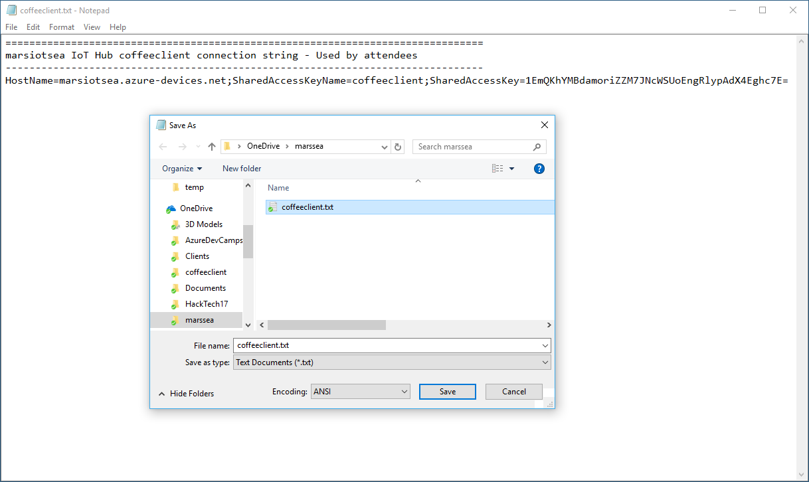

1. Right click on the new file in the OneDrive folder, and select "**Share a OneDrivelink**":

    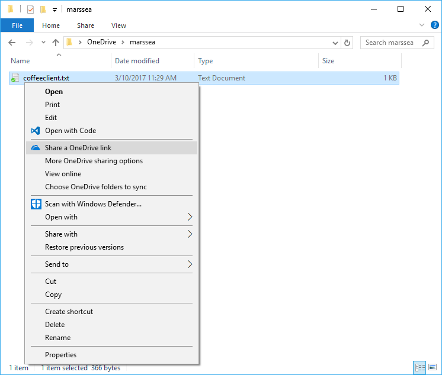

1. Use the URL Shortner of your choice and create an easy to type short URL for the text file:

    > **Note**: Use any URL shortner you like.

    


1. Edit the deck for your event, and paste your short URL in on the instruction slide for the IoT Hub mission.  Attendees will need easy access to the text file the URL points to so they can copy the cofeeclient connection string in the lab.

    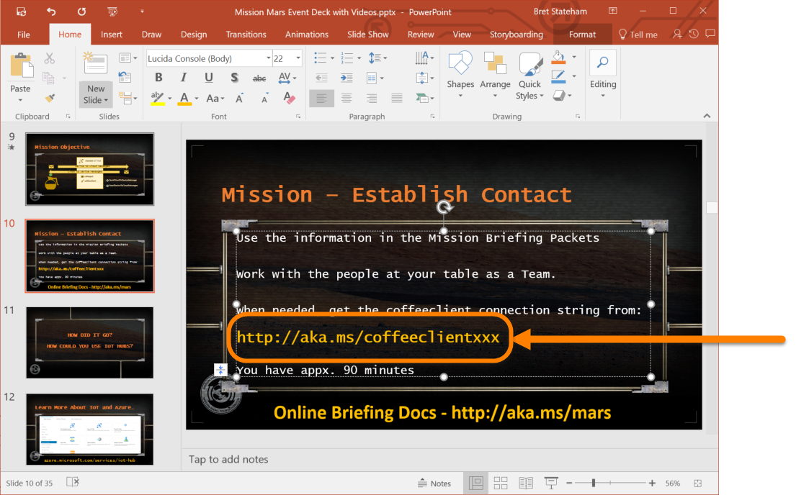

1. Keep the short URL handy during the event so you can easily share it with attendees when they need it.  Attendees will get to the portion of the lab where the connection string is needed at widely different times depending how quickly they progress through the lab.

---

<a name="run"></a>

## Run and configure the CoffeePotDevice UWP App

1. From this repo, open the "CoffeePotDevice/CoffeePotDevice.sln" solution in Visual Studio 2015 Community or later.

1. From the Debug toolbar, make sure the target platform is "x86" and the target device is "Local Machine", and start the app:

    

1. Click on the "Gear" icon in the top left corner to go to the app's settings

    


1. On the "Iot Hub Settings" tab, paste the `iothubowner` connection string returned from the `/Scripts/PrepareMarsIoTHub.ps1` script you ran earlier. ***Make sure the entire connection string is on a single line.  If it was wrapped in the output of the script above, edit it so it is all one line.***:

    > **Note**: Recall that you can use the `/Scripts/ShowMarsIoTHub.ps1` script as mentioned above to retrieve your values if you no longer have them.

    ```bash
    ================================================================================
    marsiotsea IoT Hub iothubowner connection string - Used by presenters
    --------------------------------------------------------------------------------
    HostName=marsiotsea.azure-devices.net;SharedAccessKeyName=iothubowner;SharedAccessKey=XFoYt5f3xI2ebGxRVpWCfua2++CH+1KIrP5RjRQp6ts=
     ```

    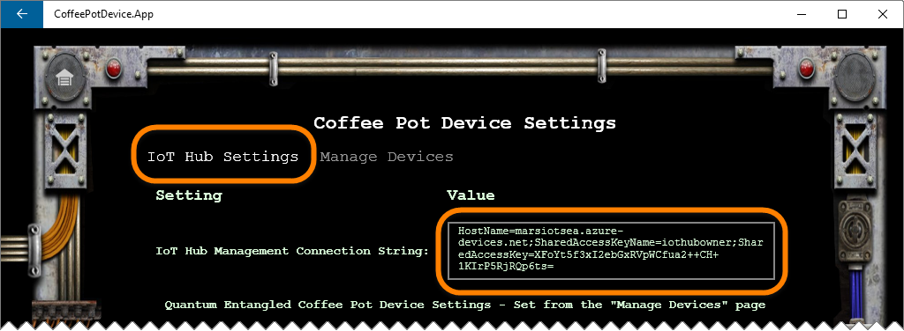

1. Switch to the "**Manage Devices**" tab, and click the "**Get Devices**" button:

    

1. You should see the "**coffeepot**" device that was created by the `/Scripts/PrepareMarsIoTHub.ps1` earlier.  Select the "**coffeepot**" device from the list, and click the "**Entangle Device**" button:

    > **Note**: The "**Entangle Device**" button is just saving the device ID and key that the CoffeePotDevice app will use when simulating the coffee pot.  Make sure that whatever device you select here, the attendees are targeting that same device in their code.

    


1. Click the "Home" icon in the top left corner to return to the main screen

    

1. You can toggle the app between Full Screen and Windowed mode using the full screen toggle button in the top right corner:

    

1. Leave the app up and running througout the event so attendees can see their messages pop up. The app has to be in the foreground to run and have the sounds associated with the messages be heard.

---

<a name="testing"></a>

## Testing the CoffeePotDevice app with Device Explorer

You can test the CoffeePotDevice app a number of ways.  

- You could of course just complete the same lab steps that attendees are instructed to do in the <a target="_blank" href="https://github.com/Mission-Mars-Fourth-Horizon-Org/Mission-Briefings/tree/master/IoTHubs">IoT Hubs Mission Briefing</a>.  You should do this at LEAST once for both .NET and Node.js as you prepare for the event.

- You can use the "Device Explorer" tool from the SDK on Windows.

- You can use the iothub-explorer Node.js command line tool. (Not documented here because I was fighting with how to pass the JSON command along from the command line)

### Testing with Device Explorer

1. Install the Device Explorer using the instructions on the <a target="_blank" href="https://github.com/Azure/azure-iot-sdk-csharp/tree/master/tools/DeviceExplorer">How to use Device Explorer for IoT Hub devices</a> page.

1. Run "**Device Explorer**" on your Windows Computer and on the "**Configuration**" tab, paste the `iothubowner` connection string from above into the "**IoT Hub Connection String**" box.  Then click the "**Update**" button, and then "**Ok**" to confirm the settings where updated.

    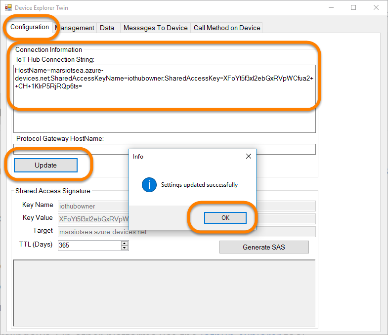

1. Switch to the "**Messages To Device**" tab, select the "**coffeepot**" device, and in the "**Message**" box, paste a valid command string as documented in the lab.  Finally, click the "**Send**" button:

    > **Note**: ***DO NOT CHECK THE "Add Time Stamp" CHECKBOX***.  This will prepend a date/time stamp to the string that is sent to the device, and will invalidate the message.

    ```json
    {"Command":"Ping","Team":"team01","Parameters":"Hello, Mars!"}
    ```

    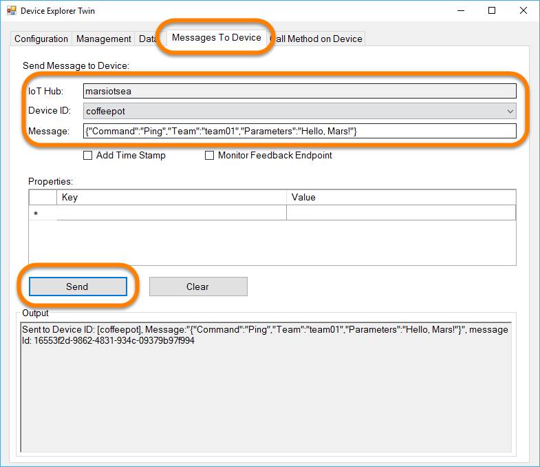

1. Back on the CoffeePotDevice app, you should see your ping message on the screen, as well as it's response.  In addition, you should have heard a distinctive "Ping" sound when the app recieved the message:

    > **Note**:  ***IF YOU DID NOT HEAR THE SOUND*** ensure that the CoffeePotDevice app was visible on the screen when you sent the message from the "Device Explorer"

    

1. Back in "**Device Explorer**" edit the command to send "Brew" instead, listen for the resulting sound and view the result in the app:

    > **Note**: The most recent messages are displayed at the ***top*** of the list in the CoffeePotDevice app.

    ```json
    {"Command":"Brew","Team":"team01","Parameters":"Hello, Mars!"}
    ```

    

    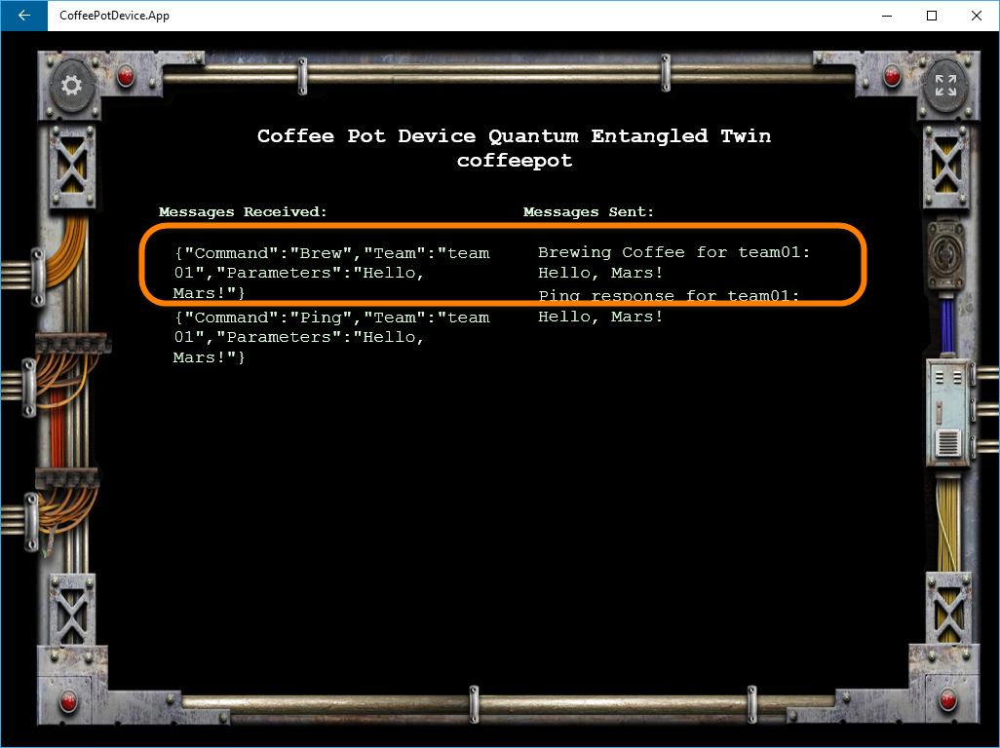

1. Next, try a command that has the right format, but isn't "Ping" or "Brew" (the only valid commands) and the listen for, and view the response:

    ```json
    {"Command":"Oops","Team":"team01","Parameters":"Hello, Mars!"}
    ```

    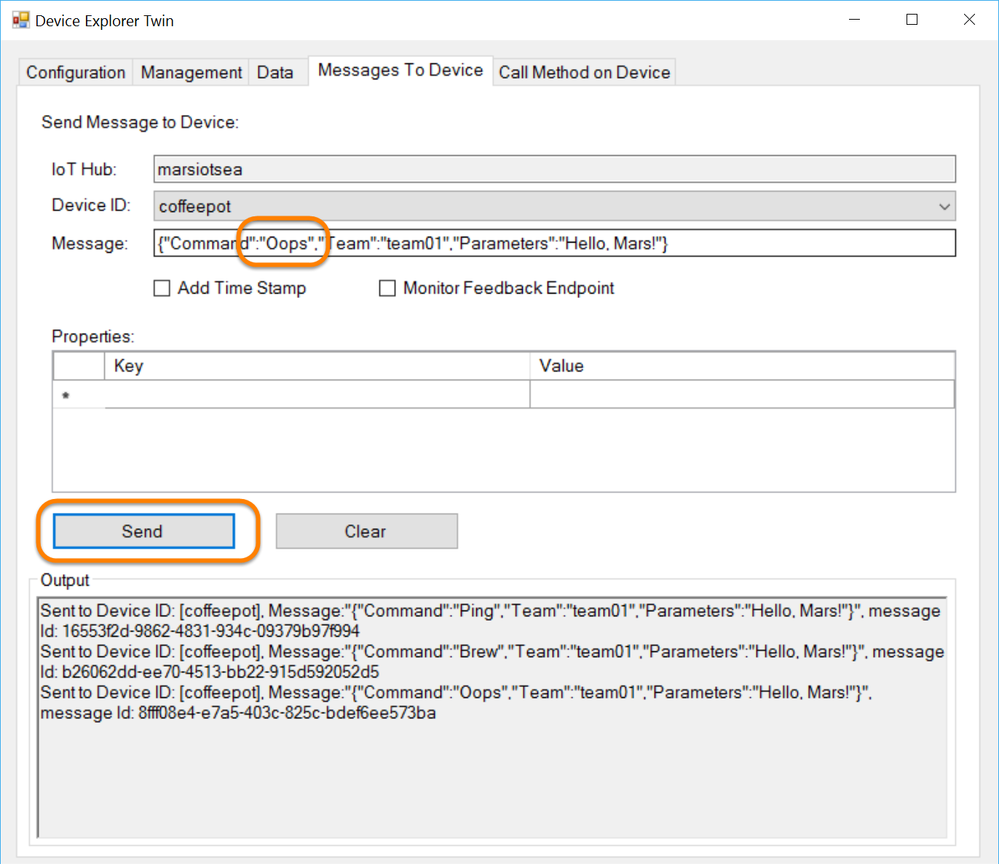

    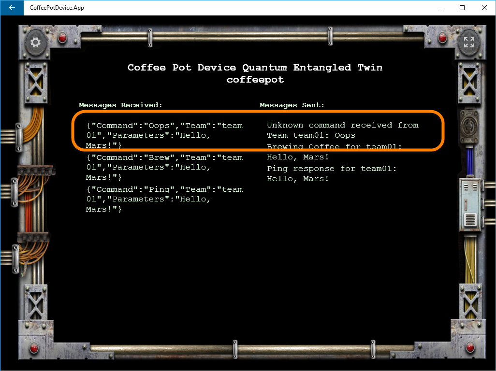

1. How about a command that doesn't meet the JSON format expected  byt he CoffeePotDevice app:

    ```json
    Oops
    ```

    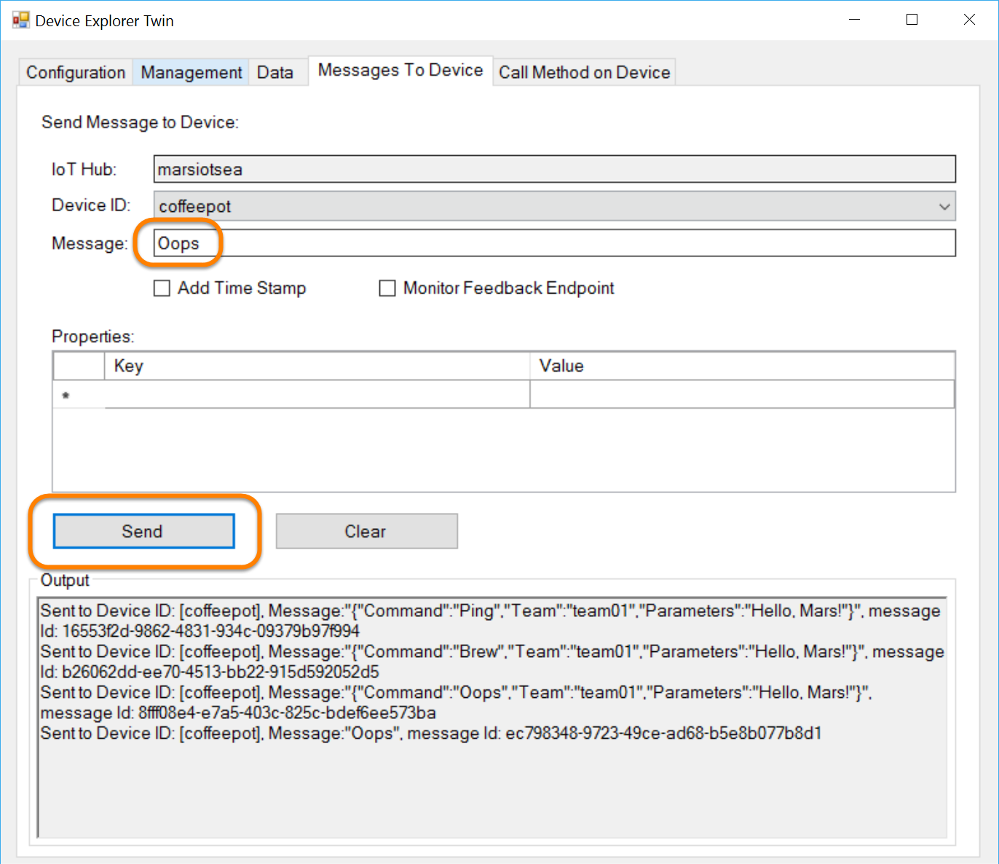

    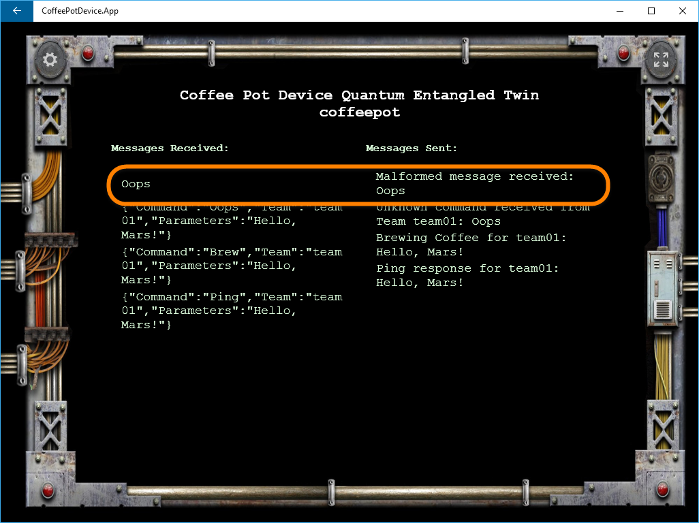

1. Finally, you can monitor the responses from the CoffeePotDevice App in the "**Device Explorer**" as shown below:

    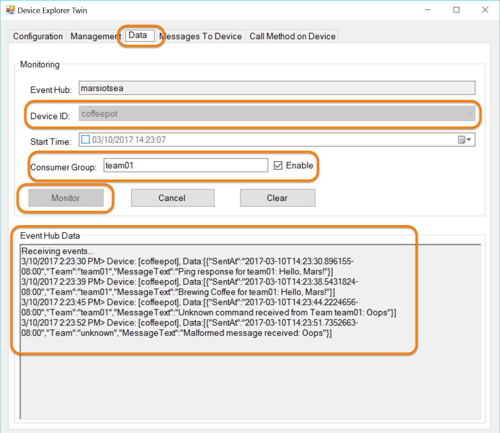

---

<a name="teamcards"></a>

## Prepare the Team Cards

The attendees need to know the team name or number they are so they can use the correct event hub consumer group when reading devices from the iot hub. The "teamxx" consumer groups were created on the iot hub during of the `PrepareMarsIoTHub.ps1` script execution above.

1. Download the two PDF files from the repo:

    - [TeamCards1to10.pdf](TeamCards/TeamCards1to10.pdf)
    - [TeamCards11to20.pdf](TeamCards/TeamCards11to20.pdf)

    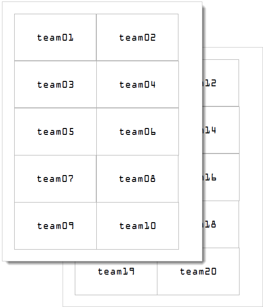

1. Print the pages out, and cut out the individual cards to distribute to the teams during the event.  

    

1. Make sure that attendees form into ***NO MORE*** than twenty teams, and that they modify the code in the "ReadDeviceToCloudMessages" program to use the "teamxx" consumer group as documented in the Mission Briefing.

---

<a name="cleanup"></a>

## Clean up after the event

Once the event is over you do not need to retain the Azure IoT Hub. The SKU used (S1) by the script currently costs $50/month to run.  No problem for a day or two, but could start to impact your available credits on a long term basis.

To clean up your Azure IoT Hub it's surprisingly simple.

1. From a command prompt where the "Azure CLI 2.0" is in the path run the following command, and enter `y` to confirm the operation:

    > **Note**: You could of course also just log in to the portal and delete the resource group from there.

    ```bash
    az group delete --name <resource-group-name>
    ```

    For example, with our `marsgroupsea` name from above:

    ```bash
    az group delete --name marsgroupsea
    ```


